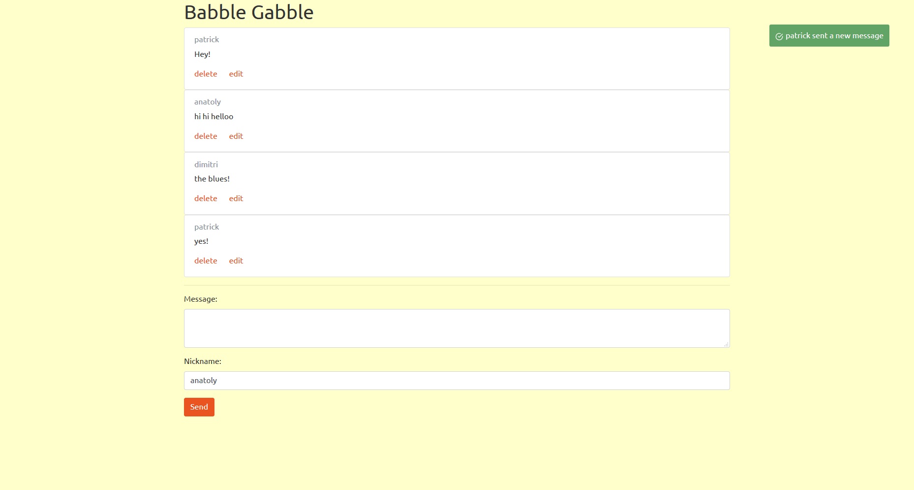
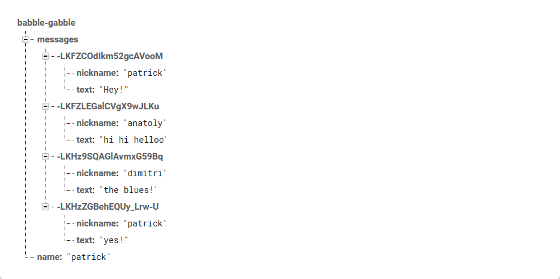

# babble-gabble
## Project aimed to help me become familiar with Google's firebase real time database.

__Left image:__ the app, which allows multiple users to communicate in realtime and receive notifications whenever a new message is added, edited, or removed.

__Right image:__ the data is modeled in Firebase's realtime, NoSQL database, which is represented as JSON.

### Technologies used:
+ VueJS
+ Firebase Realtime Database
+ [Native Toast](https://native-toast.egoist.rocks/)
+ [Bootstrap (United Theme)](https://bootswatch.com/united/)

This project followed the absolutely fantastic and concise videos from Alex Kyriakidis at [vueschool](https://vueschool.io)
